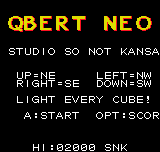
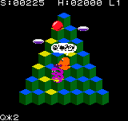

# QBERT NEO

A homebrew Q*Bert for the SNK Neo Geo Pocket Color.

**v0.4 — Demo Release** · Studio So Not Kansai

Light every cube. Dodge the balls. Do not let Coily catch you. If things
get dicey, hop off the edge onto a flying disc.

---

## Controls

The d-pad is rotated 45 degrees, arcade-port style:

| Press | Hop |
|---|---|
| **Up** | up-right |
| **Right** | down-right |
| **Down** | down-left |
| **Left** | up-left |

Diagonals also work (`Up+Left` = up-left, etc.) if you find them
easier than the single-direction mapping.

| Button | Action |
|---|---|
| **A** | start · retry · confirm |
| **Option** | pause · high scores · back to title |

---

## Play

- Hop on a cube to light it. Light **all 28** to clear the level.
- Red balls rain down and tumble off the bottom. Avoid them.
- A purple ball is a **Coily egg** — when it reaches the bottom row it
  hatches into a chasing Coily who never falls off on his own.
- Two **flying discs** hover next to the pyramid, one per side, at a
  random row each level. Hop off the edge onto one and it glides you
  back to the summit. Time it so Coily is chasing you — he will follow
  you off the pyramid instead. **500 points** for a lured Coily.
- Falling off with no disc = one life lost, and Q*Bert has some choice
  words about it.

**Levels 1-9 cycle through the arcade colour schemes.** Later levels
add extra rules: two-hop cubes (blue → intermediate → target), cubes
that revert if you land on them again, faster enemies. Level colour
scheme also cycles per revisit.

**Konami code on the title screen** (`↑↑↓↓←→←→BA`) unlocks **Mello
Mode**: the arcade Mello Yello promo palette on the pyramid, plus a
7-Eleven bonus screen between levels. A nod to the promotional
cabinets from '83.

**High scores** — top 5 with three-letter initials, saved to the
cartridge's flash storage. On emulator this uses your emulator's save
file; on real hardware, it persists across power cycles.

---

## Running the ROM

### Emulator (recommended for testing)

- **Desktop** — [Mednafen](https://mednafen.github.io/). Drop the
  `.ngc` file on the executable. Controls default to arrow keys +
  Z/X/Enter (A/B/Option). Save state is F5/F7 if you want it.
- **Android** — [RetroArch](https://retroarch.com) with the **NeoPop**
  or **RACE** core. Load content, pick the ROM.

### Real hardware

If you have a flash cart, it's a standard 256KB `.ngc` and should Just
Work. The ROM header is set up for colour mode and a non-zero cart ID,
so the boot menu should show the title correctly.

---

## What to test / what to report

This is a demo release; polish is still landing. Things I'd love
feedback on:

- **Enemy pacing** — do balls spawn too fast? Too slow? Does Coily
  give you a fair chance to reach a disc?
- **Disc placement** — the random row per level was a judgment call.
  Sometimes you'll get a disc on row 1, which is close to useless.
- **Hop input** — v0.4 has a 6-frame landing lockout on held direction
  to prevent overshoot; a fresh press still fires instantly. Does it
  feel right?
- **Death bubble position** — should be centred over Q*Bert's head.
- **Palette readability** — cube tops should always be more saturated
  than the two faces. If any scheme has tops that blend into faces,
  screenshot it.
- **Real hardware quirks** — anything that behaves differently on the
  actual NGPC vs. the emulator. The 2× WaitVsync sound-driver init and
  the flash save layout are hardware-validated from Asteroids Neo, but
  fresh eyes are welcome.

### Not in v0.4 (planned for later)

- Ugg / Wrongway (side-crawling enemies)
- Slick / Sam (cube un-lighters)
- Q*Bert Jr. bonus round
- Speech-style death sample (the current death sound is a synth
  approximation of the incoherent swearing)

If you find something broken, a screenshot and a one-line description
of what you were doing beats a long report every time.

---

## Credits

- **Code, palettes, tile art** — Studio So Not Kansai
- **Original arcade sprites** — Warren Davis / Gottlieb, 1982.
  Sheet ripped by contributors at
  [The Spriters Resource](https://www.spriters-resource.com/).
- **NGPC framework** — [ameliandev's ngpc-project-template](https://github.com/ameliandev)
- **Hardware reference** — [NgpCraft MCP](https://github.com/Tixul/NgpCraft_MCP)
- **Toolchain** — Toshiba TLCS-900H (cc900 / tulink) via Wine

Q*Bert is a trademark of Sony Pictures Entertainment. This is a
non-commercial homebrew tribute made for fun and for the love of the
NGPC. No affiliation with, or endorsement by, the rights holders.

---

*Studio So Not Kansai — Auckland, Aotearoa*
